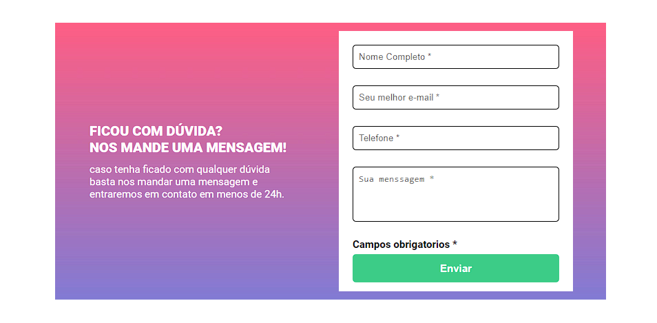
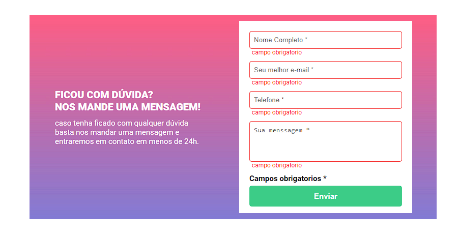
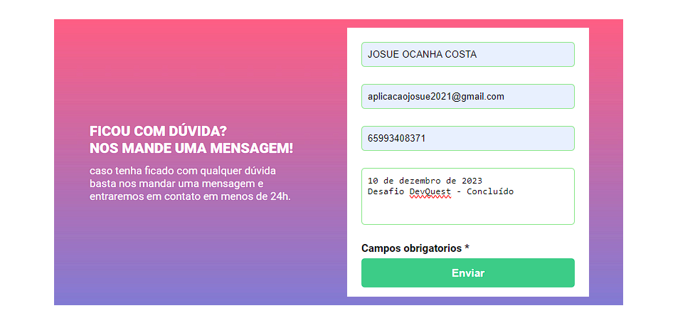

# DevQuest - JavaScript Intermediário
## Quest #2

# Desafio: Formulário com validação simples
## Objetivos:
* Criar formulário com validação de campos.
* Se preenchido os campos devem receber a cor VERDE 
* Se vazio, os campos devem ficar vermelho e também e necessário exibir uma mensagem de "campo obrigatório" abaixo do campo que estiver vazio.

## Maior dificuldade:
* Criar a lógica de programação.
* A maneira mais simples que encontrei foi trabalhar com funções, if e arrays.
* O forEach foi uma das opções mas me perdi no processo, então realizei de forma mais simples mas com maior uso de código.

## O que aprendi?
* Simplificar meu pensamento lógico, costumo pensar em soluções complexas que muitas vezes me frustram mas este desafio me ajudou a encontrar um solução simples e funcional.

### Detalhes não executados
* Não apliquei responsividade no projeto.
* O javaScript deste projeto não valida o tipo e-mail
* O javaScript deste projeto não valida o tipo number

Apesar de não validar tipos no JavaScript eu utilzei Input's e tags semânticas que permitem apenas dados de e-mail e number nos respectivos campos. 

### Screenshots
* Formulário inicial
** 

* Formulário vazio
** 

* Formulário Preenchido
** 

# Author
### Josué Ocanha Costa
#### FrontEnd Developer
#### Redes Sociais

- Linkedin - [JosueOcanhaCosta](https://www.linkedin.com/in/josue-ocanha-costa/)
- Github - [JosueCosta2023](https://github.com/JosueCosta2023)
- Twitter - [@JosueOcanhaCosta](https://twitter.com/josue_ocanha)
- Facebook - [JosueCosta](https://www.facebook.com/JosueOcanhaCosta2023)
- Whatsapp - [Josue2023](https://wa.me/5565996408371?text=Ol%C3%A1%2C+encontrei+seu+whatsapp+no+Github.+Gostaria+de+falar+sobre+seus+projetos.)
